# **Snake - Project Portfolio 2 - Javascript**

Snake is an interactive online homage to the infamous 1998 Nokia mobile game. Snake has roots in the 1976 arcade classic, Blockade, and has retianed it's legendary status largely due to it's simplistic design uncomplicated rule system. 

You can view the live site here - <a href="" target="_blank"> Snake </a>

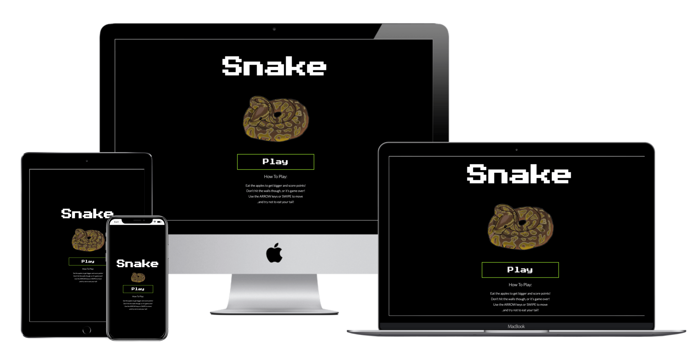

# Contents

* [Objective](<#objective>) 
* [User Experience](<#user-experience-ux>)
    * [Site Aims](<#site-aims>)
    * [User Stories](<#user-stories>)
    * [Wireframes](<#wireframes>)
    * [Site Structure](<#site-structure>)
    * [Design Choices](<#design-choices>)
    *   [Colour Scheme](<#colour-scheme>)
    *   [Typography](<#typography>)
* [Features](<#features>)
* [Future Features](<#future-features>)
* [Technologies Used](<#technologies-used>)
* [Testing](<#testing>)
    * [Code Validation](<#code-validation>)
    * [JSHint](<#jshint>)
    * [Lighthouse Testing](<#lighthouse-testing>)
    * [Accessibility Testing](<#accessibility-testing>)
    * [Responsive Testing](<#responsive-testing>)
    * [Manual Testing](<#manual-testing>)
    * [Bugs Fixed](<#bugs-fixed>)
    * [Unresolved Bugs](<#unresolved-bugs>)
* [Deployment](<#deployment>)
* [Credits](<#credits>)
* [Acknowledgements](<#acknowledgements>)

# Objective

The aim of this project is to deliver an interactive, engaging game that is visually and functionally satisfying for the user to play.

[Back to top](<#contents>)

# User Experience (UX)

## Site Aims

* To provide the user with a simple and fun interactive game
* To invoke nostalgia for the original Snake with some design throwbacks
* To create a game that encourages the user to replay and increase score 
* To provide a game that is fully responsive so the user can play across multiple platforms
* To provide an interactive experience that is easy to navigate and understand
* To provide an experience that is enjoyable but still challenging to the user so that they return to the site

## User Stories

The **user** is any person who has read the Harry Potter book series (1-7) and would like to test their Harry Potter book knowledge.

| ID | ROLE | ACTION | GOAL |
|-----------------|:-------------|:---------------:|:---------------:|
| 1 | USER | As a user, I want to be able to play Snake | So I can have some fun|
| 2 | USER | As a user, I want to be able to navigate around the interface easily | so it doesn't take me out of the experience|
| 3 | USER | As a user, I want to be able to play the game across all devices | So I can play on location, at my convenience |
| 4 | USER | As a user, I want the option of increased difficulty | So I can challenge myself |
| 5 | USER | As a user, I want to be able to start the game when I am ready | So I can prepare accordingly |
| 6 | USER | As a user, I want to be able to know my score | So I can improve on it |
| 7 | USER | As a user, I want to be able to pause the game | So I can pause if distracted |
| 8 | USER | As a user, I want to be able to start a new game when the current one ends | So I can beat my score|
| 9 | USER | As a user, I want the game to get progressively more difficult | So it's fun yet challenging |
| 10 | USER | As a user, I want the option to mute sound | So I can play without affecting others |

## Wireframes

 
 phone wireframes

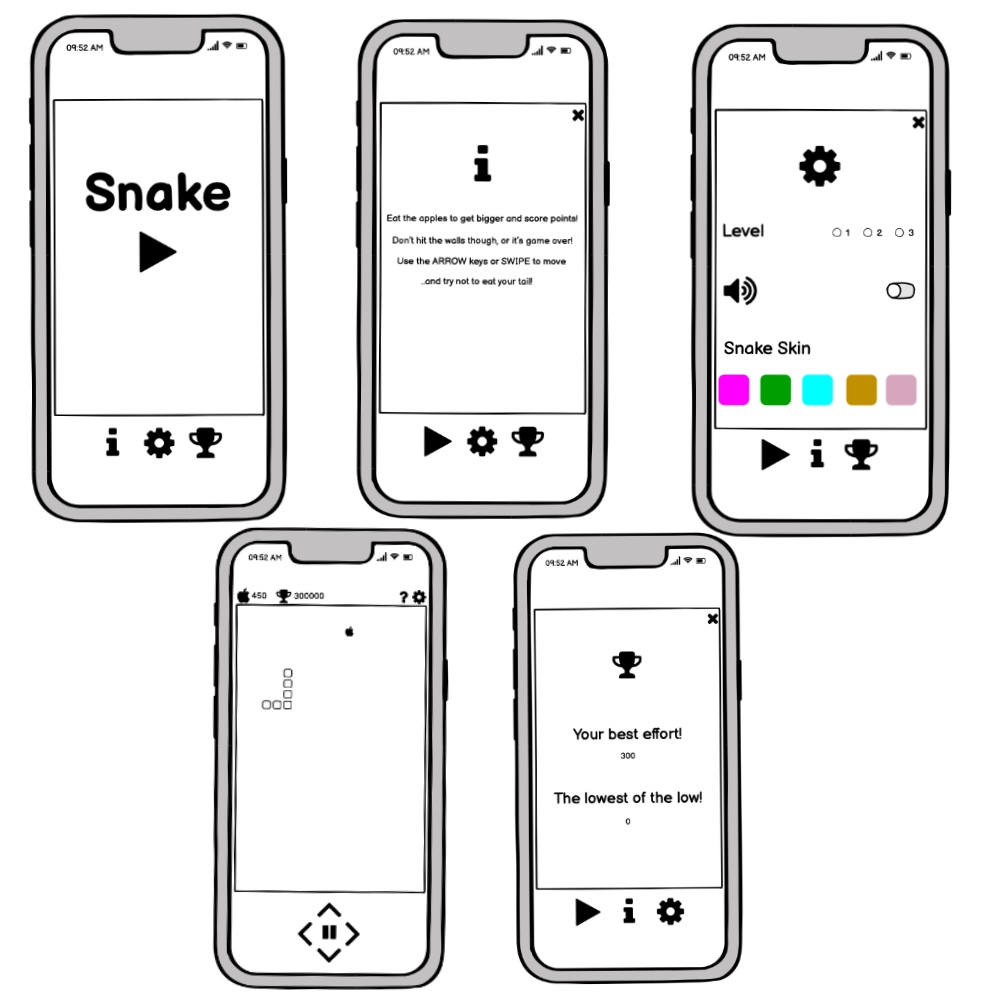

 
 tablet wireframes

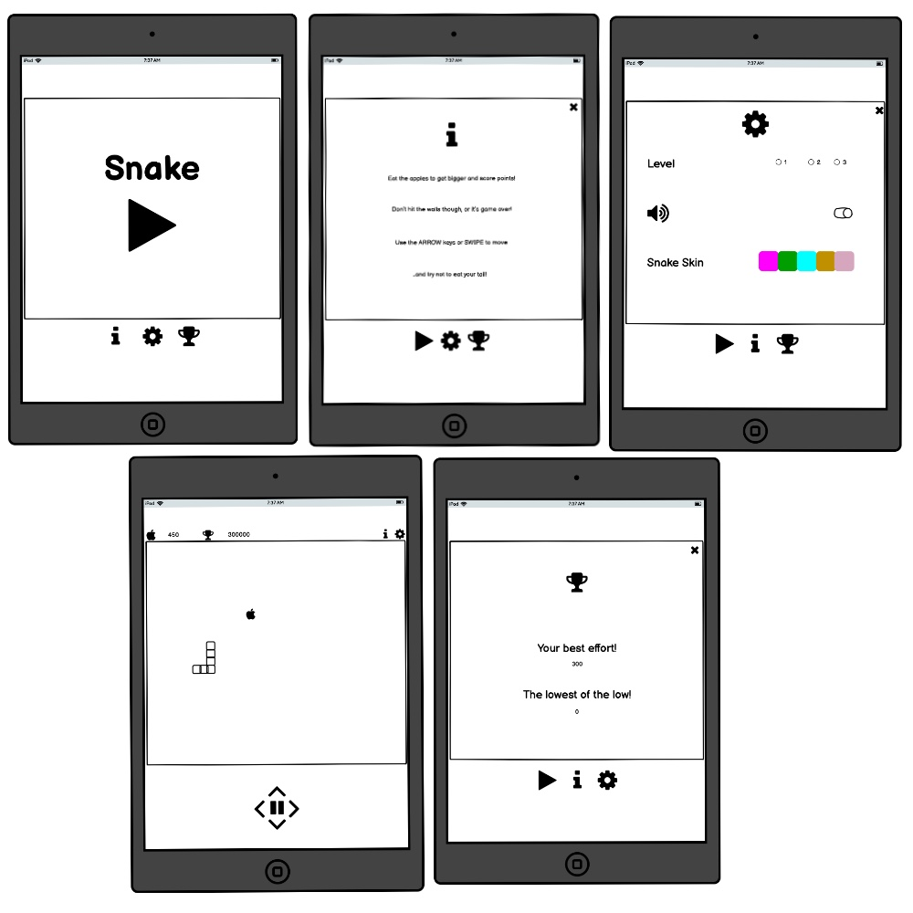

 
 desktop wireframes

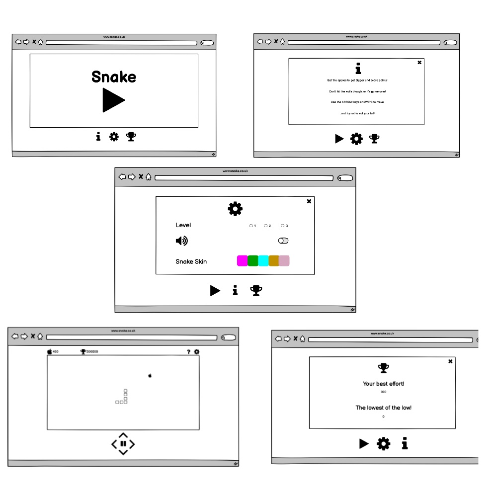

I used wireframes to initially plan the project. As the build progressed, I made some alterations based on challenges I faced, particularly for mobile devices and the need for the touch controls to be accessible on mobile. 

## Site Structure

The game lives within a one page site with 3 different 'screens', that the user navigates through to engage with the game. 

- Screen 1  The Home screen - offers one main play button, to access the game screen, and simple game instructions 
- Screen 2  The game screen - has a game area and control buttons 
- screen 3 The game over screen - informs the user the game is over, and their current score 

Screens 2 and 3 have a top bar which offers a route back to the home page, and a toggle sound mute button. Upon the snake's collision with either a wall or itself, the user is automatically taken to the game over screen that on closure gives the option to navigate back to the home screen.

## Design Choices

### Colour Scheme

The final color theme of neon green, black and white was chosen due to it's dual personality of both past and future. Neon, to evoke the 90's, against monochrome black and white to maximize contrast and imply speed, simplicity and modernity. The dominating black background allows the neon to glow against it, and pop's both the snakeskin and apple features. 

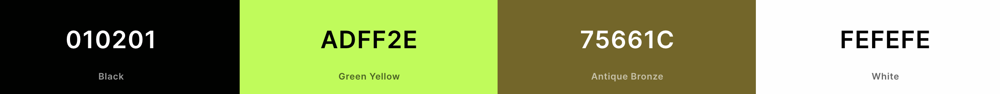

### Typography

The fonts chosen continue the past present theme, with 'Press Start 2P' (headings) for it's retro pixelated design and 'Lato' (body) for it's modern simple curves and easy readability to maximise enjoyment of the site.   

[Back to top](<#contents>)

# Features

This game of Snake was created to produce a 'no fuss' experience for the user with a simple design and site structure. It's centered around mobile first design and feels similar to an app. 

It's intuitively designed so the user can navigate it with ease, with prominent Home and Sound button icons, and visual and audio feedback on events occurred.

## Home Screen

* The Home Screen is visible on site load. It's designed to be easily understandable, and to allow user to immediately start the game play.
* The site title sits on top of a snake gif, so the user has no doubt as to what the site is.
* In the middle of the screen, the unmistakable play button invites the user to begin immediately.
* Below this, the how to play section informs the user of the simple game rules.

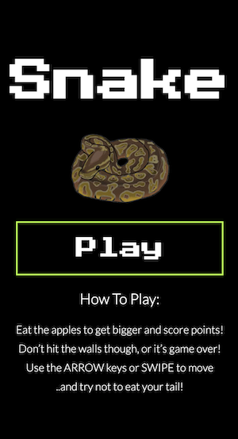
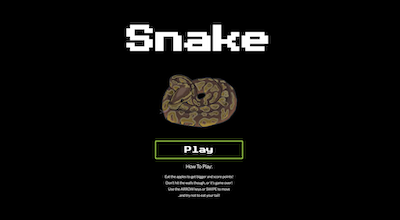

## Top bar

* The user can navigate to the home screen from the game and game over screens through the home button, top left
* The icon is a universally recognised home
* The sound button, top right, retains it's position on the game and game over screens and the sound can be activated or muted by the user as they wish.
* Upon mute, the button turns neon green
* On the quiz starting two more informative icons are added to the right of these: the timer countdown and the user's score.
* The navbar is responsive and does not change order throughout screen size changes.

Mobile top bar images

Desktop top bar images

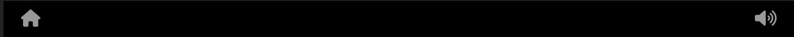

## Game Screen - Core of the Application

* This is the heart of the game. The user is presented with the game area, pre-populated with a snake and apple. The game begins automatically on screen load and the snake begins to move to the right. 
* The touch control buttons below the game area are arranged in a diamond shape with universally recognised arrows indicating their function. They change the snake's direction.   
* On desktop, the arrow keys can also be used to change direction of the snake, indicated in the How To Play section on the home screen.
* Within the touch controls diamond, lies the pause button. This pauses the game on touch and toggles to a play button. On second touch the game continues from where it was. This feauture can't be underestimated! It avoids the user's bitter dissapointment should a distraction arise mid play, and cause game over. Now the user can pause, deal with said distraction, and get back to eating apples! 
* The score section, atop the game, indicates how many apples have been swallowed and increments by 1 to keep things simple. 
* The user can return home at any point during a live game, and from here we have the comforting familiarity of the home page and the play button can generate a new game if desired. 

Mobile Game Screen

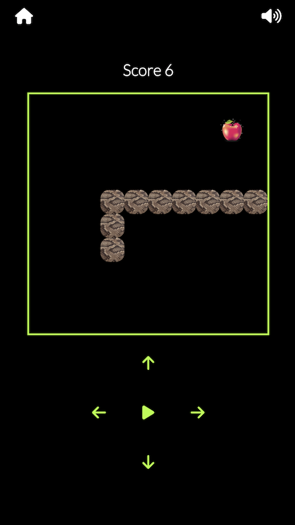

Desktop Game Screen

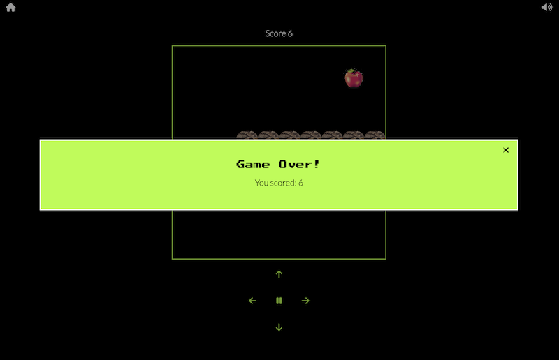

## Game Over Screen

* The Game Over screen becomes visible on the snake's collision with either a wall or itself.
* It informs the user of game over and then indicates their score
* The close icon, top right, closes the game over screen and allows the user to navigate back home for a repeat performance.

Mobile Game Over Screen

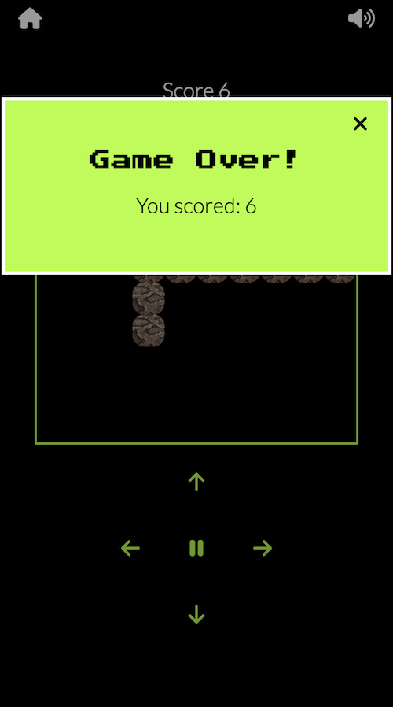

Desktop Game Over Screen

## Sound

* the user has the option to mute/unmute sound via the sound button on the top bar at all times during the game 
* The sound gives the user additional feedback as they play for a satifiying UX
* On snake direction change there are modern tonal sounds, which traverse the musical scale in the same direction as the snake moves
* On ingestion of an apple there's a comedy bite sound to amplify the satisfaction of a feed!

# Future Features 

## Hammer JS swipe touch controls 

* Regrettably the tight deadline denied me the joy of implementing touch screen gestures with Hammer JS, however this would be the first scheduled upgrade!

## Difficulty levels

* Several different levels - including speed increase, multiple snakes and extra walls - could be intorduced. They would be accessed via a settings button, and toggled with radio buttons as indicated in the wireframes

## Interchangeable Snake Skins

* Within the settings screen, the user could also toggel through a variety of colourful snake skin desigs, for increased enjoyment of the game

## High Scores 

* would sit on top of the current score on the game screen, and indicate the user's highest score to date. This would increase the user's level of engagemnt and desire to improve 

## Global Highscores

* Instead of saving the high scores locally, saving the scores on a global level would raise the level of engagement with the game, as users could compete against other people while accessing the site from different devices.

[Back to top](<#contents>)

# Technologies Used

* HTML5 - Site structure and content 
* CSS3 - Site styling
* Javascript - Site functionality and styling
* [Auto Prefixer](https://github.com/postcss/autoprefixer) - PostCSS plugin to parse CSS and add vendor prefixes to CSS
* [Balsamiq](https://balsamiq.com/) - for wireframe creation
* [Optimizilla](https://imagecompressor.com/) - Used to compress images
* [Giphy](https://giphy.com/) - to create
* [Final Cut Pro](https://www.apple.com/uk/final-cut-pro/) - to manipualte snake animation for gif
* Google Chrome DevTools - Used to debug and test responsiveness of the site
* Gitpod - Used to develop the website
* GitBash - Terminal used to push changes to the GitHub repository
* GitHub - Used to host and deploy the website

[Back to top](<#contents>)

# Testing

## Code Validation

This game has been tested via W3C HTML validator and W3C CSS validator. There were a few minor errors that came up for the HTML pages which were immediately corrected and documented down below in [Bugs Fixed](<#bugs-fixed>).

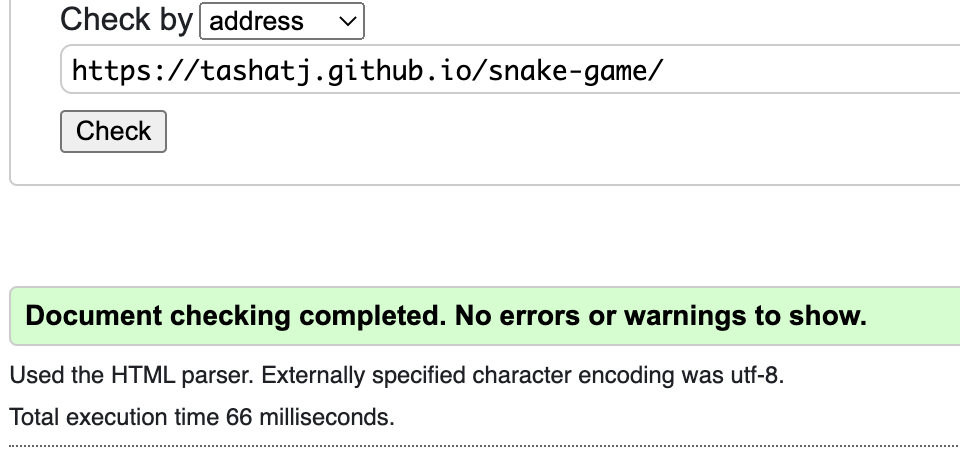
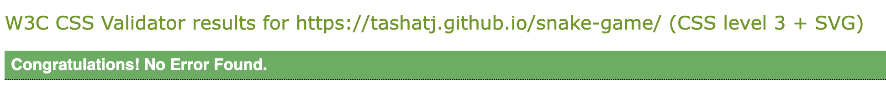

## JSHint

The Javascript file was validated in JSHint. Initially there were a couple of undefined varibles which have since been defined

JSHint came up with no errors and multiple warnings which are explained below in [Unresolved Bugs](<#unresolved-bugs>).

## Lighthouse Testing

The site was also tested on Performance, Accessibility, Best Practices and SEO via Lighthouse testing in Chrome DevTools. Both mobile and desktop performaces were tested.

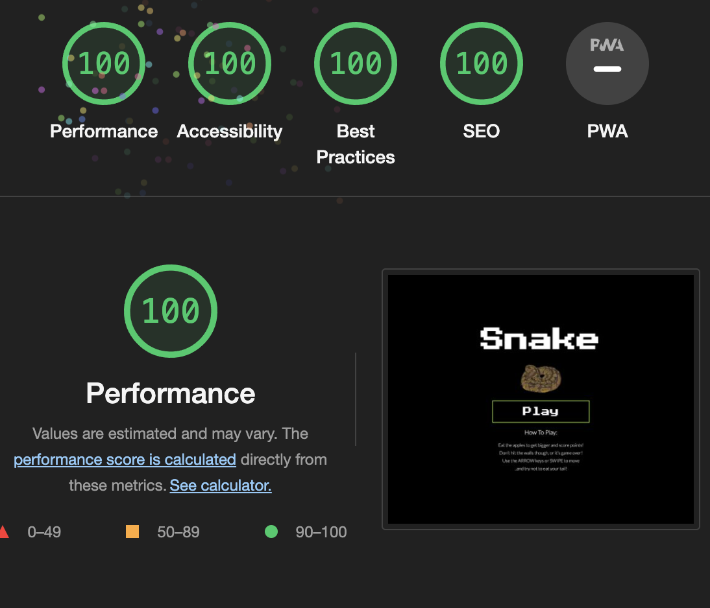

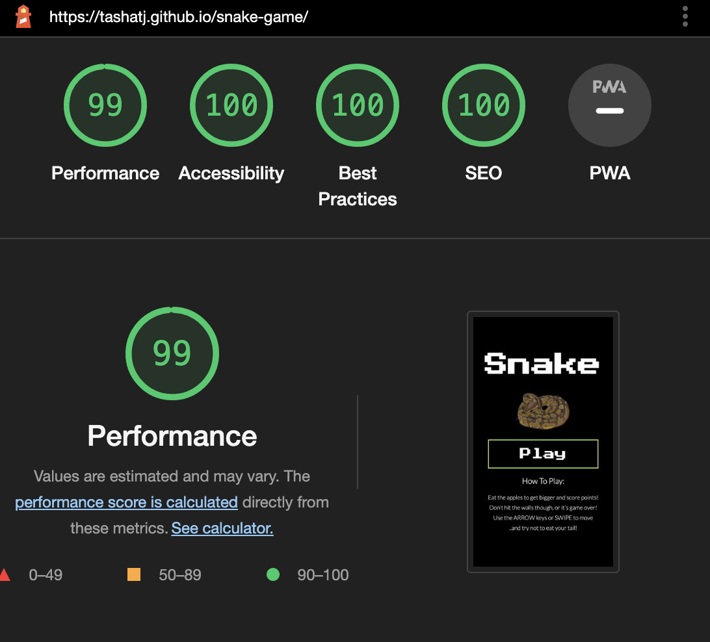

Initially there was an error in the performance test, which is related to a chrome bug when dealing with Keyframes and Opacity 0 when testing in some instances. This has since been fixed. You can find documentation here:

[Chrome bug](https://github.com/GoogleChrome/lighthouse/issues/11603)

## Accessibility Testing

The website passed it's color contrast for accessibility purposes test via A11y color contrast accessibility validator 

## Responsive Testing

Responsiveness was tested via Chrome Devtools, The Viewport Resizer chrome extension and The Responsive Design Checker website.

[Back to top](<#contents>)

## Manual Testing

In addition to the automated sites above, manual testing included:

- firefox, 
- safari 
- chrome 

and multiple devices 
- iphone 13 pro
- ipad pro
- samsung galaxy s22
- macbook pro

[Back to top](<#contents>)

* Home Screen

    * Verified that clicking the play Button icon initiates game

* Game Screen

    * Verified that clicking the Home Button icon on the top-bar brought the user back to the home screen
    * Verified that clicking the Sound Button icon on the top-bar brought the user to mute/unmute as desired
    * Verified that all touch controls work in their indicated direction
    * Verified that the pause button toggles from play to pause to play as many times as the user presses it
    * Verified that the game speed increased as the game progressed 
    * Verified that the scores kept count of the number of apple eaten
    * Verified that all sounds work if the sound is toggled on; touch controls, arrows and ingestion of apple
    * Verified that upon collision of walls or ingestion of apple, the game ends and the game over screen bec omes visible

* Game Over Screen

    * Verified that clicking close button on the game over screen closed the modal 
    * Verified that clicking the Home Button icon on the top-bar (left) brought the user back to the Home screen where the play button worked as predicted to initialise a new game 
    * Verified that toggling the sound button icon on the top-bar (right) toggles the sound mute/unmute as desired
    * Verified that all sounds work if the sound is toggled on; background music and button clicks.

## Bugs Fixed

### Right Wall Collision 

There was an unexpected behavior occuring on snake collsion with the right wall, as it looped round and came back through the left wall instead of displaying the game over screen. This was fixed with a simple >= in the logic as opposed to just a >.

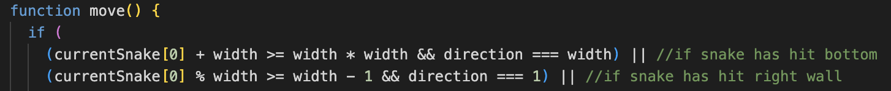

### The Score displayed in Game Over Screen 

The score was sporadically appearing in the game over screen, this was fixed by adjusting the setInterval function in the javascript. 

### Apple genereated within snake body 

undesirably, the apple was occasionally generating within the snake body. This was a logical error and fixed within the javascript with a for loop that disabled such behavior

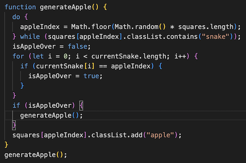

## Unresolved Bugs

### JSHint Validation

JSHint validation returned clean

### Mobile sound issues

There are sound trigger issues if playing the game on mobile, including most of the touch controls and overlap of apple sounds should apples be eaten in quick succession. This is due to inbuilt OS settings which stop sounds playing by default.
Additional info can be found [here](https://stackoverflow.com/questions/17889297/sound-does-not-play-in-mobile)

[Back to top](<#contents>)

# Deployment

The website was deployed to GitHub pages via the following methods:

1. Navigate to the settings tab in the GitHub repository 
2. Once in settings, navigate to the pages tab on the left of the page 
3. Under source, select branch ‘master’ and then click ‘save’
4. page will no automatically refresh and show a detailed ribbon display to indicate deployment 

Deployment Process

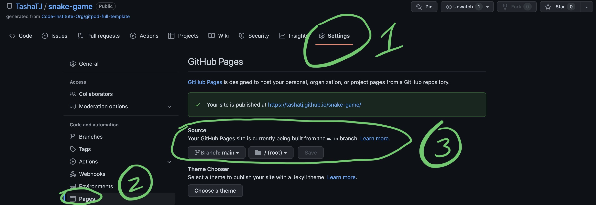

## To fork the repository on GitHub

To make a copy or ‘fork’ the repository - 

1. Log into GitHub and locate repository 
2. On the right hand side of the page select the ‘fork’ option to create and copy of the original

Forking Process

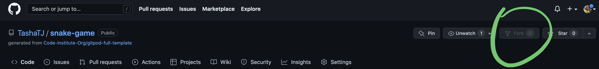

## To clone the repository on GitHub

1. under the repository name, click on the ‘code’ tab 
2. in the clone box, HTTPS tab, click on the clipboard icon 
3. in your IED open GitBash 
4. Changed the current working directory to the location you want the cloned directory to be made
5. Type ‘git clone’ and then paste the URL copied from GitHub
6. press enter and the local clone will be created 

Cloning Process

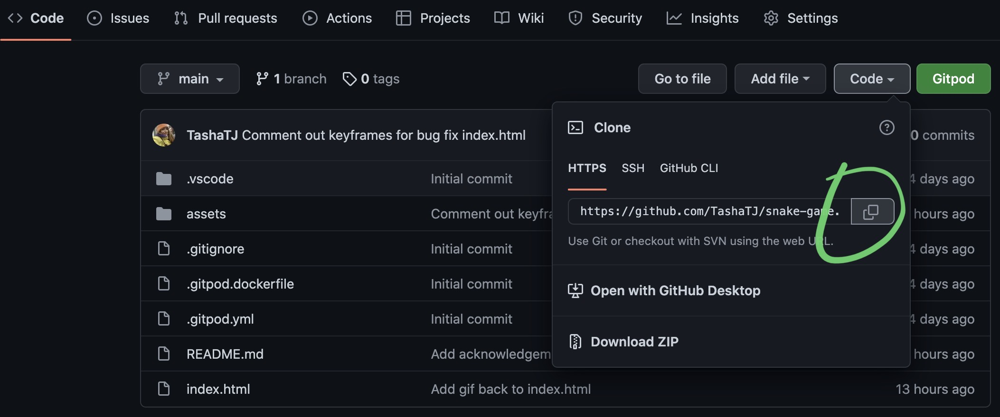

[Back to top](<#contents>)

# Credits

* [Modal creation tutorial](https://www.w3schools.com/howto/howto_css_modals.asp)
* [Modal creation tutorial](https://youtu.be/XH5OW46yO8I)
* [Tutorial about coding snake](https://youtu.be/7Azlj0f9vas)
* [another tutorial about coding snake](https://youtu.be/7Azlj0f9vas)
* [Tutorial for learning about setInterval and setTimeout](https://developer.mozilla.org/en-US/docs/Learn/JavaScript/Asynchronous)
* [The this keyword in Javascript](https://www.w3schools.com/js/js_this.asp)
* [Dom manipulation refresher](https://youtu.be/y17RuWkWdn8)
* [Javascript game refresher](https://youtu.be/UUFPEgRKwf4)
* [Very informative coding youtube channel](https://www.youtube.com/channel/UCuwL6KfTU7VoDZYZuE1WMfA)

[Back to top](<#contents>)

# Acknowledgements

This website was executed and completed as a portfolio 2 Project for the full stack diploma at [Code Institute](https://codeinstitute.net/). 
I would like to firstly thank my mentor, Precious Ljege for his guidance, and fellow students at Code Institute, for participating in the peer code review.  

Tasha Taylor Johnson, 2022.

[Back to top](<#contents>)

